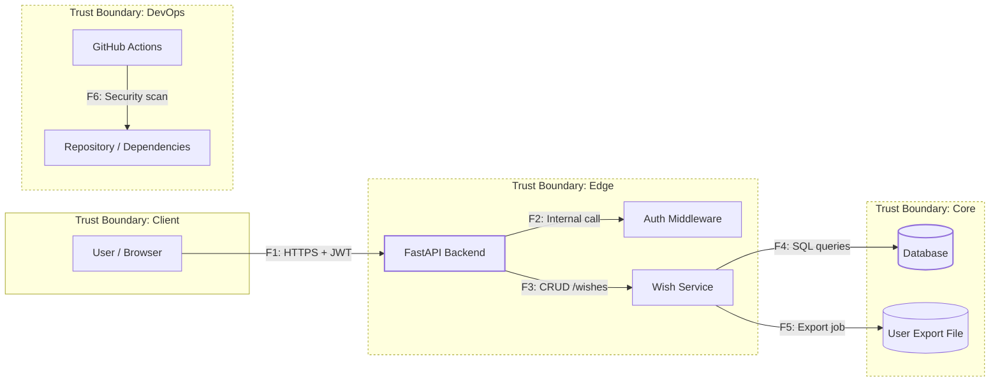

# DFD — Data Flow Diagram (Wishlist Project)

| ID     | Откуда → Куда              | Канал / Протокол           | Данные / PII                       | Комментарий                                                  | Связь с NFR    |
| ------ | -------------------------- | -------------------------- | ---------------------------------- | ------------------------------------------------------------ | -------------- |
| **F1** | User → API                 | HTTPS + JWT                | Credentials, Tokens                | Вход, регистрация, аутентификация (AuthN)                    | NFR-02         |
| **F2** | API → Auth Middleware      | Python func     | user_id, token                     | Проверка токена и прав доступа (AuthZ)                       | NFR-01         |
| **F3** | API → Wish Service         | FastAPI router             | title, link, price_estimate, notes | CRUD-операции, валидация входных данных                      | NFR-03, NFR-04 |
| **F4** | Wish Service → SQLite      | SQL            | wishes, owner_id                   | Запись/чтение данных владельца; контроль целостности         | NFR-08         |
| **F5** | Wish Service → Export File | JSON/CSV      | Wishes data (owner only)           | Генерация экспорта, ограничение размера и времени            | NFR-06         |
| **F6** | CI/CD → Repo/Dependencies  | GitHub Actions | configs          | Автоматическая проверка зависимостей (SCA)                   | NFR-07         |
| **F7** | User → API                 | HTTPS                      | CRUD requests                      | Нагрузочное использование; производительность (p95 ≤ 200 мс) | NFR-05         |
